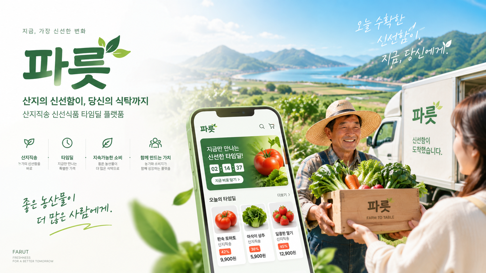
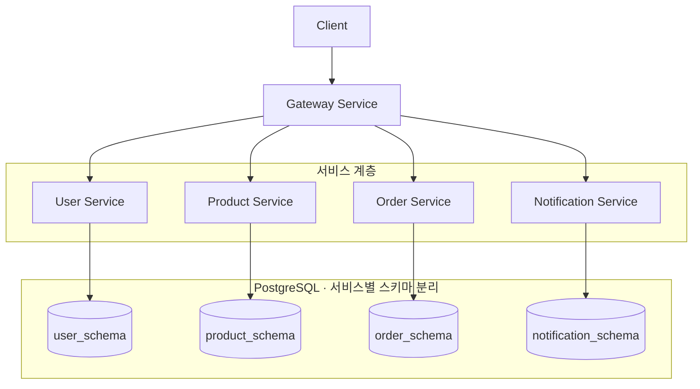

# PARUT

일반상품과 한정 수량 타임딜을 함께 운영하는 신선식품 마켓플레이스입니다. 회원과 상품 관리부터 재고 선점, 주문, 결제, 배송, 환불, 구매확정, 정산과 알림까지의 흐름을 마이크로서비스로 구성했습니다.

## 발표자료와 시연영상

- [프로젝트 발표자료](./docs/presentation/parut-presentation.pdf)
- [서비스 시연영상](./docs/presentation/parut-demo.mp4)
- [프로젝트 Notion](https://innovative-sunshine-4ce.notion.site/5-PARUT-7e486ebf7b7f83c7930501b89ac2c0dc?pvs=73)

## 핵심 기능

- 회원가입, 로그인, 사용자 상태 검증과 배송지 관리
- 일반상품과 타임딜 상품 등록 및 조회
- 일반상품 재고 선점, 확정과 복구
- 타임딜 재고 선점과 구매 예약
- 장바구니, 주문 생성, 결제와 주문 취소
- 배송 상태 관리와 자동 배송완료
- 환불 요청, 승인과 거절
- 수동 및 자동 구매확정
- 정산 생성, 조회와 일괄 완료
- 타임딜 오픈 임박 알림

## 서비스 구성

| 서비스 | 역할 |
| --- | --- |
| Gateway Service | 외부 요청 라우팅, JWT 검증과 사용자 식별 정보 전달 |
| User Service | 회원, 인증, 사용자 상태와 주소 관리 |
| Product Service | 일반상품, 일반 재고, 타임딜과 타임딜 재고 관리 |
| Order Service | 장바구니, 주문, 결제, 배송, 환불, 구매확정과 정산 관리 |
| Notification Service | Kafka 이벤트를 소비해 사용자 알림 생성 및 조회 |

### 전체 서비스 아키텍처

Gateway를 단일 진입점으로 두고 사용자, 상품, 주문, 알림을 담당하는 4개 서비스로 구성했습니다. 각 서비스의 데이터는 PostgreSQL의 독립 스키마로 관리합니다.

| 공통 구성 | 역할 |
| --- | --- |
| OpenFeign · WebClient | 서비스 간 HTTP 통신 |
| Redis | 캐시, 재고 선점 및 시간 예약 관리 |
| Kafka | 서비스 간 이벤트 전달 |
| Prometheus · Grafana | 메트릭 수집 및 모니터링 |
| Docker · Docker Compose | 서비스와 인프라 컨테이너 구성 |

## 기술 스택

| 구분 | 기술 |
| --- | --- |
| Backend | Java, Spring Boot, Spring Data JPA, Spring Cloud Gateway, OpenFeign, WebClient |
| Data and Messaging | PostgreSQL, Redis, Kafka |
| Infrastructure | Docker, Docker Compose, Prometheus, Grafana |
| Test | JUnit 5, Postman, JMeter |

## 주요 설계

### 일반 재고 동시성 제어

동시 재고 선점에서 발생하는 락 충돌을 줄이기 위해 비관적 쓰기 락을 적용했습니다. 여러 재고를 처리할 때는 ID 순서로 잠가 교착 상태 가능성을 낮추고, 주문상품별 이벤트 이력으로 중복 반영을 방지합니다.

### 타임딜 재고 선점

Redis Lua Script로 재고 확인과 차감을 원자적으로 처리합니다. 중복 주문, 재고 부족과 재고 미초기화 상태를 구분하며, 예약 취소나 만료 시 재고를 복구합니다.

### 타임딜 상태 전환

Redis Sorted Set에 오픈과 종료 예정 시각을 저장합니다. 예정 시각이 지난 처리 대상을 조회하고, Lua Script로 대상을 원자적으로 선점합니다.

### 알림 이벤트 전달

타임딜 오픈 임박 이벤트를 Outbox에 저장한 뒤 별도 Publisher가 Kafka로 발행합니다. Notification Service는 이벤트를 소비해 사용자 알림을 생성합니다.

### 배치 처리

커서 기반 분할 조회로 한 번에 처리하는 대상 수를 제한합니다. 항목별 트랜잭션을 적용해 한 건의 업무상 실패가 다른 대상의 처리 결과를 되돌리지 않도록 했습니다.

### 정산 일괄 완료

관리자의 일괄 완료 요청은 정산별 독립 트랜잭션으로 처리하고 항목별 성공과 실패 결과를 반환합니다. 예상 가능한 상태 오류와 낙관적 락 충돌은 해당 정산의 실패로 기록하며, 예상하지 못한 시스템 오류는 전체 요청 밖으로 전파합니다.

## 성능 검증

로컬 Docker 환경의 단일 서비스 인스턴스를 대상으로 JMeter 부하 테스트를 수행했습니다. 아래 수치는 해당 측정 환경에서 얻은 결과입니다.

### 일반 재고 선점

초기 재고 1,000개에 500건의 동시 요청을 보내 개선 전후를 비교했습니다.

| 지표 | 개선 전 | 개선 후 |
| --- | ---: | ---: |
| 락 충돌 실패율 | 65.4% | 0% |
| P95 응답 시간 | 11,751ms | 6,765ms |
| 처리량 | 10.7 req/s | 14.6 req/s |

테스트 시나리오와 실행 방법은 [일반 재고 성능 테스트 문서](./product-service/performance-test/product_stock/README.md)에 정리했습니다.

### 타임딜 동시 구매

초기 재고 100개에 500건의 동시 구매 요청을 보내 재고 상태와 성능을 비교했습니다.

| 지표 | 개선 전 | 개선 후 |
| --- | ---: | ---: |
| 구매 및 예약 결과 | 구매 이력 500건, 예약 수량 58 | 예약 성공 100건, 예약 수량 100 |
| P95 응답 시간 | 12,848.95ms | 8,023ms |
| 처리량 | 38.16 req/s | 61.30 req/s |

테스트 시나리오와 실행 방법은 [타임딜 성능 테스트 문서](./product-service/performance-test/timedeal/README.md)에 정리했습니다.

## 서비스별 문서

- [Gateway Service](./gateway-service/README.md)
- [User Service](./user-service/README.md)
- [Product Service](./product-service/README.md)
- [Order Service](./order-service/README.md)
- [Notification Service](./notification-service/README.md)
